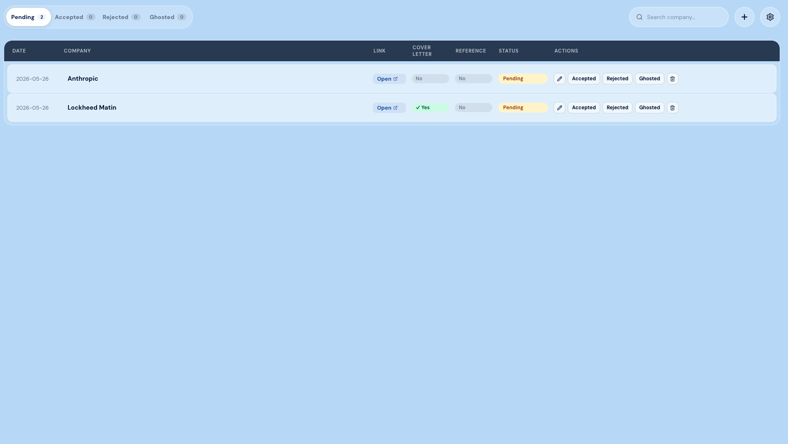
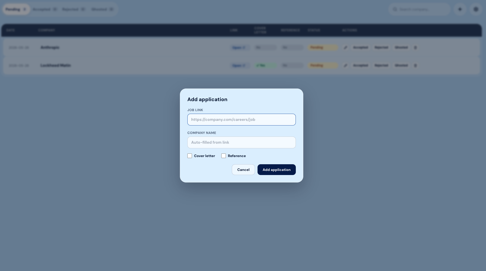
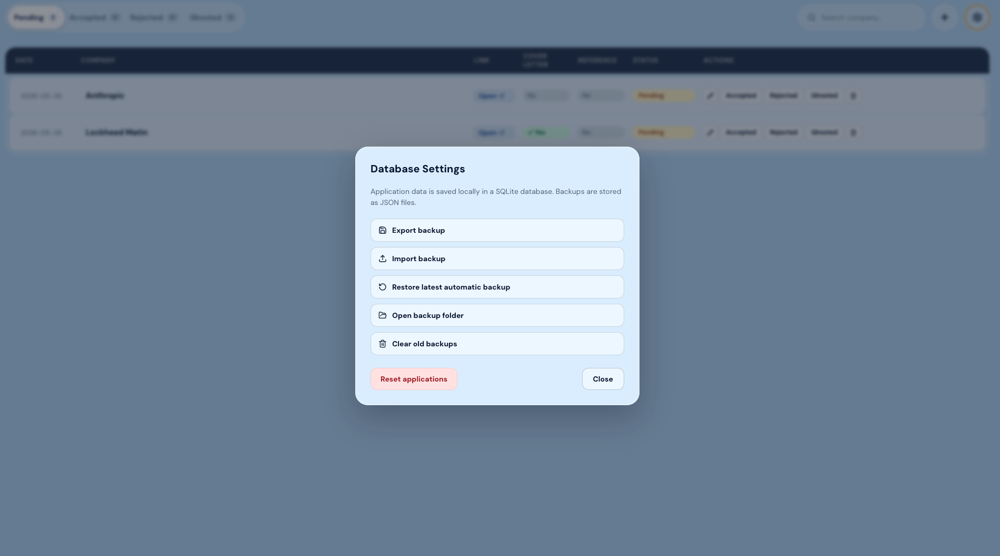

# Job Application Tracker

Desktop app for tracking job applications. Stores data locally in SQLite with JSON backup and restore.

## Screenshots



<table>
<tr>
<td align="center">

<br>
<sub>Add Application</sub>
</td>
<td align="center">

<br>
<sub>Database Settings</sub>
</td>
</tr>
</table>

## Features

- Add, edit, delete, and search applications
- Track status: Saved, Applied, Accepted, Rejected, Ghosted
- Search across company, title, and location
- Group applications by location
- Flag whether a cover letter or reference was used
- Export, import, and restore JSON backups

## Tech Stack

- **Language:** TypeScript
- **UI:** React
- **Desktop runtime:** Electron
- **Build tool:** Vite
- **Database:** SQLite
- **Styling:** CSS

## How to Run

Clone and install once:

```bash
git clone https://github.com/matolks/job-application-tracker.git
cd job-application-tracker
npm install
```

Then choose one:

**Run in development**

```bash
npm run desktop
```

**Build a Windows installer**

```bash
npm run dist:win
```

Open the generated `.exe` in `release/`.

**Build a macOS installer**

```bash
npm run dist:mac
```

Open the generated `.dmg` in `release/`.

## Roadmap

- Upload and download of cover letters
- Auto-move to Ghosted after a configurable number of days
- Graph export for application history and outcomes
- Restore UX beyond toggling to the latest backup

## License

MIT
